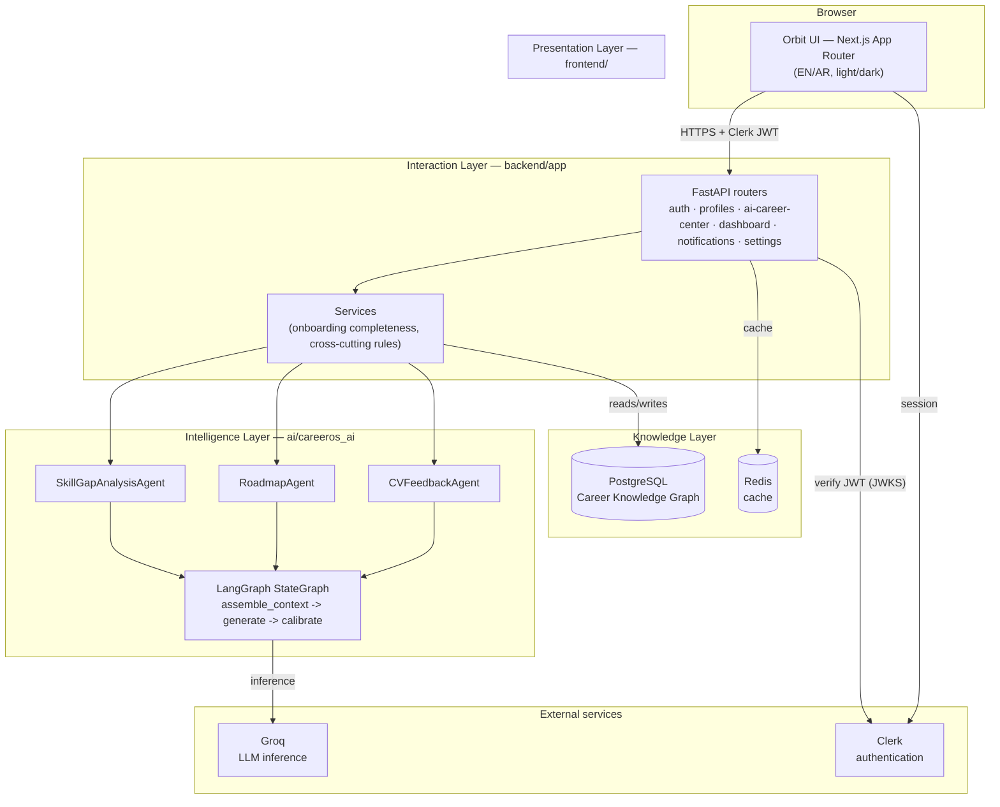

# Orbit (CareerOS)

**Your AI Career Operating System.**

Orbit is the public, user-facing brand name for **CareerOS**, an AI-native platform that gives students and fresh graduates a single, persistent system for managing and growing a career: a continuously updated model of a person's goals and skills, worked on by a coordinated set of AI agents that identify gaps, build a roadmap, and give feedback on career materials. "Orbit" is a presentation-layer name only — the backend, database, and every architecture document still refer to the project as CareerOS, which is why the repository, code, and this document use both names depending on context.

> Built as an SDAIA Academy capstone project.

---

## Table of contents

- [Problem statement](#problem-statement)
- [Solution](#solution)
- [Features](#features)
- [AI architecture](#ai-architecture)
- [Multi-agent overview](#multi-agent-overview)
- [Tech stack](#tech-stack)
- [System architecture](#system-architecture)
- [Folder structure](#folder-structure)
- [Installation](#installation)
- [Environment variables](#environment-variables)
- [Docker instructions](#docker-instructions)
- [Local development](#local-development)
- [Screenshots](#screenshots)
- [Presentation](#presentation)
- [Deployment status](#deployment-status)
- [Known limitations](#known-limitations)
- [Future work](#future-work)
- [Testing](#testing)
- [Documentation](#documentation)
- [SDAIA Academy attribution](#sdaia-academy-attribution)
- [License](#license)

---

## Problem statement

Career development for students and fresh graduates is fragmented and reactive. Career guidance is generic (one-size-fits-all advice, not tied to a person's actual skills or goal), fragmented across disconnected tools (a resume reviewer here, a course catalogue there, a job board somewhere else), and static — nothing tracks whether a person is actually closing the gap between where they are and where they want to be, or updates its advice as they change.

## Solution

Orbit gives each user one continuously-updated model of themselves — their background, their goal, their skills — and a small set of specialized AI agents that work against that model:

1. **Understand the gap.** Compare the user's current skills against what their chosen goal requires, and explain the gap in plain language, with a calibrated confidence level rather than false certainty.
2. **Build a plan.** Turn that gap into a concrete, ordered roadmap of steps, generated automatically whenever the analysis changes.
3. **Improve the materials.** Give structured, grounded feedback on a CV or career document against the user's actual goal.

Every AI output is explainable on request (what it's grounded on), calibrated (confidence level + reason, never a false 100%), and owned by exactly one agent — no two agents ever write the same data, so there's always one clear source of truth for any given piece of a user's Career Knowledge Graph.

## Features

- **Authentication** — Clerk-based sign up / sign in, JWT session verification, full account deletion (local data + the real upstream Clerk identity)
- **Onboarding** — a four-step guided wizard (background → goal → skills → first AI analysis) that a completed account never re-enters
- **Profile & Goals** — editable profile, one active goal at a time, goal history and reactivation, a completeness checklist showing exactly what's missing for a better analysis
- **Skill-Gap Analysis** — AI-generated gap analysis against the user's active goal, versioned, with an on-request plain-language explanation of what it's grounded on
- **Roadmap** — an ordered set of steps auto-generated from the current analysis, with per-item status tracking (the AI owns the content, the user owns the status)
- **CV / Career-Document Feedback** — submit text, get feedback split into factual/structural findings vs. judgment calls, each item tagged with its relevance to the active goal
- **Dashboard** — an at-a-glance summary of the user's current analysis, roadmap progress, and recent activity
- **Notifications** — an activity timeline for analysis, roadmap, and feedback completions, with per-category muting
- **Settings** — account, subscription (view/cancel with reason, renewal recap), notification preferences, theme + language, data export/deletion, and account deletion
- **Progress** — career-readiness snapshot, the AI's own summary, a skill-improvement timeline across analysis versions, and a milestones timeline
- **Accessibility & i18n** — full English/Arabic bilingual support with real RTL layout (not machine-translated filler), dark/light theme, and a WCAG-AA-verified color system
- **Explainability everywhere** — every AI-generated output (analysis, roadmap, feedback) can be explained on request: what data it used and why it reached its conclusion

## AI architecture

The Intelligence Layer (`ai/careeros_ai`) is a separate top-level Python package, imported by the backend rather than folded into it — the codebase keeps "reasoning" (`ai/`) and "persistence + HTTP" (`backend/`) as distinct layers on purpose. No agent ever writes to the database directly: every agent returns a typed data-transfer object, and the backend's service layer is the only thing that persists it — into the one table that specific agent is declared to own.

| Principle | What it means here |
|---|---|
| **Single LLM provider** | Every agent runs on **Groq** (`langchain-groq`), one place (`ai/careeros_ai/llm.py`) decides the model — no per-agent provider sprawl |
| **Write ownership** | Each agent owns exactly one entity; no two agents ever write the same table (see the table below) |
| **Fail loud, never degrade silently** | An agent that can't produce a trustworthy result raises rather than returning a low-confidence, unflagged answer — the prior valid state is left untouched |
| **Calibrated confidence** | Every AI output ships a confidence level *and* the reason for it, derived from real signals (e.g. profile completeness), never a hardcoded "high" |
| **Grounded explainability** | Every output can be explained on request — what data it was grounded on — computed from the real inputs, not an afterthought summary |

## Multi-agent overview

Three specialized agents, each implemented as a small **LangGraph** `StateGraph`, not a single monolithic prompt:

```
SkillGapAnalysisAgent   assemble_context → generate → calibrate
RoadmapAgent             assemble_context → generate → calibrate
CVFeedbackAgent          assemble_context → generate → calibrate
```

Each node has one job — gather the real inputs, call Groq for the actual generation, then calibrate a confidence score against real signals — so the reasoning steps are inspectable and testable independently, not one opaque prompt-to-output hop.

| Agent | Owns (writes) | Reads |
|---|---|---|
| `SkillGapAnalysisAgent` | `skill_gap_analysis` | profile, goal, its own previous version |
| `RoadmapAgent` | `roadmap` (item *content* only, never status) | current skill-gap analysis, its own previous version |
| `CVFeedbackAgent` | `cv_feedback_round` | goal, the submitted document — nothing else |

The three agents are not orchestrated as one live conversation between them — each is invoked at a specific point in the product flow (goal set → analysis; analysis changes → roadmap regenerates automatically; document submitted → feedback), and each is independently unit-testable via a fake `.run(input) -> output` substitute, without needing a live Groq key.

## Tech stack

| Layer | Choice |
|---|---|
| Frontend | Next.js 15 (App Router), React 19, TypeScript, Tailwind CSS, shadcn/ui + Radix primitives |
| Backend | Python 3.12, FastAPI, Pydantic v2, SQLAlchemy 2.0 (async) |
| AI orchestration | LangGraph, LangChain, **Groq** (`langchain-groq`) |
| Database | PostgreSQL (+ pgvector-ready image) |
| Auth | Clerk |
| File storage | Supabase Storage (declared, not yet wired to a real upload flow — see [Known limitations](#known-limitations)) |
| Cache | Redis |
| Containerization | Docker + Docker Compose (local dev) |
| Observability | LangSmith tracing, OpenTelemetry |
| Testing | Pytest (`ai/`, `backend/`), Playwright (`frontend/`) |

## System architecture



Layer boundaries are enforced by write-ownership, not just convention: the Presentation layer never computes business logic or confidence — it only renders what the Interaction layer already decided; the Intelligence layer never touches Postgres directly — it only returns typed DTOs for the Interaction layer's service layer to persist.

## Folder structure

```
CareerOS/
├── frontend/            # Next.js 15 app (Presentation Layer) — see frontend/README.md
├── backend/              # FastAPI app (Interaction Layer + Knowledge persistence) — see backend/README.md
│   ├── app/
│   │   ├── core/         # settings, Clerk JWT verification
│   │   ├── db/            # SQLAlchemy models, async session
│   │   ├── services/      # cross-cutting business rules
│   │   ├── schemas/        # Pydantic request/response models
│   │   └── api/routers/    # one router per product module
│   ├── migrations/        # Alembic
│   └── tests/              # pytest, hermetic (SQLite + fake agents)
├── ai/                    # LangGraph/LangChain agents (Intelligence Layer) — see ai/README.md
│   └── careeros_ai/
│       ├── agents/         # SkillGapAnalysisAgent, RoadmapAgent, CVFeedbackAgent
│       ├── capabilities/    # explainability, confidence calibration, grounding
│       └── knowledge/       # DTO contracts crossing Intelligence <-> Knowledge
├── docker/                # docker-compose.yml + Dockerfiles for local dev
├── Dockerfile              # Production copy of docker/backend.Dockerfile, for hosts that
│                           # require a root-level Dockerfile (e.g. Render's Docker runtime)
├── infrastructure/         # Postgres bootstrap, env templates
├── docs/                   # PRD, Solution Architecture Specification, ADRs
├── scripts/                # native (non-Docker) dev-workflow scripts
└── Makefile                # make up / make migrate / make test-backend, etc.
```

## Installation

Prerequisites: **Docker Desktop** (recommended path) or **Node.js 20+** and **Python 3.12+** for a native setup, plus API keys for Clerk and Groq.

```bash
git clone <this-repository-url>
cd CareerOS
cp .env.example .env   # fill in CLERK_*, GROQ_API_KEY (see below)
```

## Environment variables

Copy `.env.example` to `.env` and fill in real values. Never commit `.env` (already covered by `.gitignore`).

| Variable | Required for | Notes |
|---|---|---|
| `POSTGRES_USER` / `POSTGRES_PASSWORD` / `POSTGRES_DB` / `POSTGRES_PORT` | Local Docker Postgres | Defaults work out of the box for local dev |
| `DATABASE_URL` | Backend | `postgresql+asyncpg://...` — SQLAlchemy async driver scheme required |
| `REDIS_URL` | Backend | `redis://...` |
| `CLERK_SECRET_KEY` | Backend | Server-side Clerk key; also required for real account deletion |
| `CLERK_PUBLISHABLE_KEY` / `NEXT_PUBLIC_CLERK_PUBLISHABLE_KEY` | Frontend | Clerk publishable key (same value, two names for server/client contexts) |
| `SUPABASE_URL` / `SUPABASE_SERVICE_ROLE_KEY` / `SUPABASE_STORAGE_BUCKET` | Backend (future) | Not required today — file upload isn't wired to Supabase Storage yet |
| `GROQ_API_KEY` | AI agents | Required for every real Skill-Gap Analysis / Roadmap / CV Feedback generation |
| `LANGCHAIN_TRACING_V2` / `LANGCHAIN_API_KEY` / `LANGCHAIN_PROJECT` | Observability (optional) | Enables LangSmith tracing |
| `OTEL_EXPORTER_OTLP_ENDPOINT` | Observability (optional) | OpenTelemetry export target |
| `CORS_ALLOWED_ORIGINS` | Backend | Comma-separated frontend origin(s) allowed to call the API |
| `NEXT_PUBLIC_API_URL` | Frontend | Browser-reachable backend URL |
| `API_URL` | Frontend (Docker only) | Container-network backend address (`http://backend:8000`); leave unset outside Docker Compose |
| `BACKEND_PORT` / `FRONTEND_PORT` | Docker Compose | Local port mapping |
| `ENVIRONMENT` | Backend | `development` / `production` |

## Docker instructions

The full stack (Postgres, Redis, backend, frontend) via Docker Compose:

```bash
cp .env.example .env   # fill in Clerk + Groq keys first
make up                 # or: docker compose -f docker/docker-compose.yml up --build
```

- Frontend: <http://localhost:3000>
- Backend: <http://localhost:8000> · Swagger UI: <http://localhost:8000/docs>

Apply database migrations inside the running container:

```bash
docker compose -f docker/docker-compose.yml exec backend alembic upgrade head
```

## Local development

Without Docker, each part runs natively — see each folder's own README for the full walkthrough:

```bash
# Backend
cd backend
python -m venv .venv && .venv\Scripts\activate      # or: source .venv/bin/activate
pip install -r requirements-dev.txt
pip install -r ../ai/requirements.txt && pip install -e ../ai
alembic upgrade head
uvicorn app.main:app --reload

# Frontend (separate terminal)
cd frontend
npm install
npm run dev
```

See [`backend/README.md`](backend/README.md), [`ai/README.md`](ai/README.md), and [`frontend/README.md`](frontend/README.md) for testing commands, architecture detail, and each folder's own known gaps.

## Screenshots

_Screenshots are not yet included in this repository — placeholders below, to be replaced with real captures._

| Marketing site | Dashboard |
|---|---|
| _placeholder_ | _placeholder_ |

| Skill-Gap Analysis | Roadmap |
|---|---|
| _placeholder_ | _placeholder_ |

## Presentation

Project presentation: <https://orbit-slide-exact.lovable.app/>

## Deployment status

| Component | Status |
|---|---|
| **Frontend** | Deployed on Vercel: <https://frontend-ten-navy-5njxz04vw1.vercel.app> — marketing pages, sign-in/sign-up, and the app shell load correctly. Currently running with a **development-mode Clerk instance** (not a production Clerk instance), and pointed at a backend that is not yet fully live (see below), so authenticated, data-dependent pages will not yet work end-to-end from the deployed frontend. |
| **Backend** | **Deployment currently in progress, not complete.** A backend service and its own free-tier Postgres/Redis have been provisioned on Render, but database migrations have not yet been applied against a production database, so no data-dependent endpoint is confirmed working in production yet. **The backend runs correctly and is fully tested locally via Docker** (`make up`) — this is the reliable way to run and evaluate the full product today. |
| **Database** | Not yet finalized — mid-transition to a free-tier external Postgres provider at the time of writing. Locally, the app runs against a standard Dockerized PostgreSQL image. |
| **AI (Groq)** | Fully working, verified against a real Groq API key in local/Docker runs (`backend/scripts/verify_e2e.py`) — 18-step real end-to-end run against real Postgres and real Groq, not mocked. |

**In short: the product is complete and fully verified locally/via Docker. Cloud deployment is real but partial — do not assume the public frontend URL demonstrates the full working product yet.**

## Known limitations

Tracked in detail, feature-by-feature, against the PRD in [`PHASE0-AUDIT.md`](PHASE0-AUDIT.md) (method: every row checked against actual code, not assumed). Headline items:

- **Cloud deployment is incomplete** — see [Deployment status](#deployment-status) above.
- **File upload for CV/Profile Feedback isn't wired to real storage.** The feature accepts pasted/typed text (a real, complete pipeline — generation, explanation, deletion) rather than a file upload through Supabase Storage; the schema field for a storage path exists for when that's built.
- **No automatic material-change detection.** Skill-Gap Analysis can be refreshed on request (a real, working button), but nothing yet auto-triggers a refresh when a qualifying profile edit happens.
- **No roadmap version history or change-diffing.** Only the current roadmap is queryable; there's no "what changed between version N and N+1" view yet.
- **No payment processor.** Subscription/renewal data is real, computed on demand — there's no actual billing-cycle integration (e.g. Stripe) behind it.
- **Live Clerk account deletion is code-complete but not exercised end-to-end** in every environment — it correctly fails closed (a 502, not a silent no-op) whenever `CLERK_SECRET_KEY` is unset, rather than pretending to succeed.

## Future work

- Complete and verify the cloud backend deployment (production Postgres reachable from the chosen host, migrations applied, production Clerk instance).
- Real file upload for CV/Profile Feedback via Supabase Storage.
- Automatic material-change detection to auto-trigger analysis refreshes.
- Roadmap version history and cross-version change explanations ("what changed and why").
- A real payment processor integration behind Settings' subscription/renewal views.
- Expansion beyond the AI Career Center module (Learning Hub, Jobs & Internships, Community, Portfolio) per the long-term product vision in the PRD — deliberately out of scope for this phase.

## Testing

```bash
# Backend — 47 tests, hermetic (SQLite in-memory, fake AI agents, no live Postgres/Groq needed)
cd backend && pytest tests/

# ai package — 5 tests, pure logic, no API key needed
cd ai && pytest tests/

# Real end-to-end verification against live Postgres + live Groq
cd backend && python -m scripts.verify_e2e   # or: make verify-e2e
```

52/52 hermetic tests passing as of the last full run; the end-to-end script additionally walks the complete real product flow (profile → goal → analysis → roadmap → CV feedback → notifications → settings) against a live database and live Groq calls, with results independently confirmed via direct `psql` queries.

## Documentation

- [Product Requirements Document](docs/01-Product/PRD.md) — what CareerOS is and why every decision exists
- [Solution Architecture Specification](docs/02-Solution-Architecture/SAS.md) — the structural shape: layers, boundaries, contracts
- [`PHASE0-AUDIT.md`](PHASE0-AUDIT.md) — the feature-by-feature completion matrix, checked against actual code
- [`CHANGELOG.md`](CHANGELOG.md) — session-by-session implementation history
- [`CONTRIBUTING.md`](CONTRIBUTING.md) — repository governance and contribution rules

## SDAIA Academy attribution

This project was built as a capstone project for the **SDAIA Academy**.

## License

Released under the [MIT License](LICENSE).
