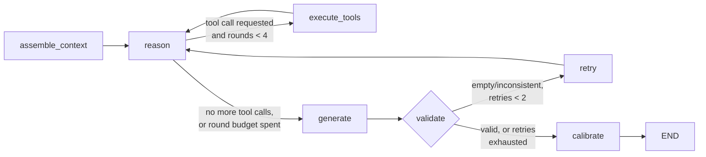
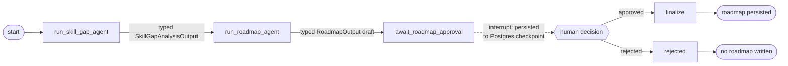
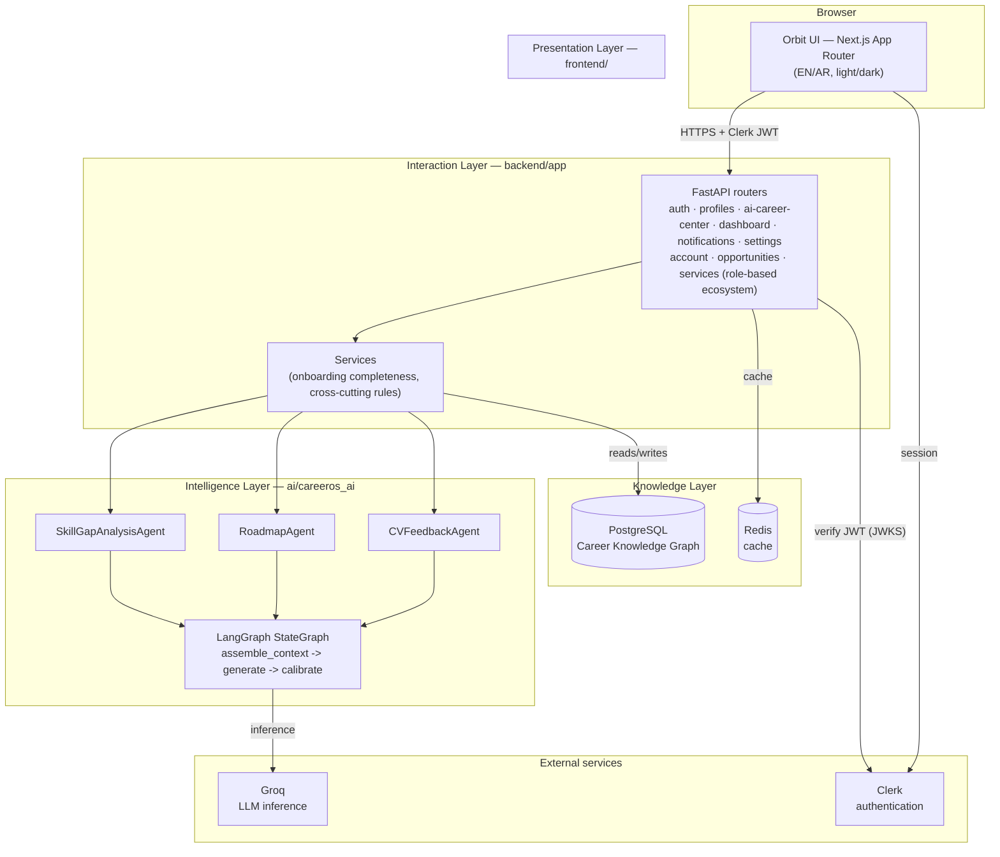
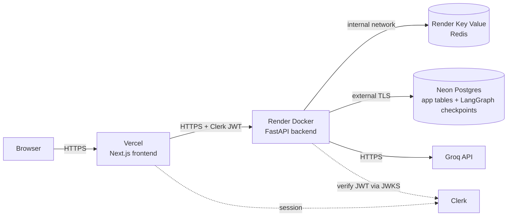

# Orbit (CareerOS)

**Your AI Career Operating System.**

Orbit is the public, user-facing brand name for **CareerOS**, an AI-native platform that gives students and fresh graduates a single, persistent system for managing and growing a career: a continuously updated model of a person's goals and skills, worked on by a coordinated set of AI agents that identify gaps, build a roadmap, and give feedback on career materials. "Orbit" is a presentation-layer name only — the backend, database, and every architecture document still refer to the project as CareerOS, which is why the repository, code, and this document use both names depending on context.

> Built as an SDAIA Academy capstone project.

---

## Table of contents

- [Problem statement](#problem-statement)
- [Solution](#solution)
- [Features](#features)
- [Role-based ecosystem](#role-based-ecosystem)
- [Interview Preparation, Video Interview & Community](#interview-preparation-video-interview--community)
- [AI architecture](#ai-architecture)
- [Multi-agent overview](#multi-agent-overview)
- [Tech stack](#tech-stack)
- [System architecture](#system-architecture)
- [Folder structure](#folder-structure)
- [Installation](#installation)
- [Environment variables](#environment-variables)
- [Docker instructions](#docker-instructions)
- [Local development](#local-development)
- [Screenshots](#screenshots)
- [Presentation](#presentation)
- [Deployment status](#deployment-status)
- [Known limitations](#known-limitations)
- [Future work](#future-work)
- [Testing](#testing)
- [Documentation](#documentation)
- [SDAIA Academy attribution](#sdaia-academy-attribution)
- [License](#license)

---

## Problem statement

Career development for students and fresh graduates is fragmented and reactive. Career guidance is generic (one-size-fits-all advice, not tied to a person's actual skills or goal), fragmented across disconnected tools (a resume reviewer here, a course catalogue there, a job board somewhere else), and static — nothing tracks whether a person is actually closing the gap between where they are and where they want to be, or updates its advice as they change.

## Solution

Orbit gives each user one continuously-updated model of themselves — their background, their goal, their skills — and a small set of specialized AI agents that work against that model:

1. **Understand the gap.** Compare the user's current skills against what their chosen goal requires, and explain the gap in plain language, with a calibrated confidence level rather than false certainty.
2. **Build a plan.** Turn that gap into a concrete, ordered roadmap of steps, generated automatically whenever the analysis changes.
3. **Improve the materials.** Give structured, grounded feedback on a CV or career document against the user's actual goal.

Every AI output is explainable on request (what it's grounded on), calibrated (confidence level + reason, never a false 100%), and owned by exactly one agent — no two agents ever write the same data, so there's always one clear source of truth for any given piece of a user's Career Knowledge Graph.

## Features

- **Authentication** — Clerk-based sign up / sign in, JWT session verification, full account deletion (local data + the real upstream Clerk identity)
- **Onboarding** — a four-step guided wizard (background → goal → skills → first AI analysis) that a completed account never re-enters
- **Profile & Goals** — editable profile, one active goal at a time, goal history and reactivation, a completeness checklist showing exactly what's missing for a better analysis
- **Skill-Gap Analysis** — AI-generated gap analysis against the user's active goal, versioned, with an on-request plain-language explanation of what it's grounded on
- **Roadmap** — an ordered set of steps auto-generated from the current analysis, with per-item status tracking (the AI owns the content, the user owns the status)
- **CV / Career-Document Feedback** — submit text, get feedback split into factual/structural findings vs. judgment calls, each item tagged with its relevance to the active goal
- **Dashboard** — an at-a-glance summary of the user's current analysis, roadmap progress, and recent activity
- **Notifications** — an activity timeline for analysis, roadmap, and feedback completions, with per-category muting
- **Settings** — account, subscription (view/cancel with reason, renewal recap), notification preferences, theme + language, data export/deletion, and account deletion
- **Progress** — career-readiness snapshot, the AI's own summary, a skill-improvement timeline across analysis versions, and a milestones timeline
- **Accessibility & i18n** — full English/Arabic bilingual support with real RTL layout (not machine-translated filler), dark/light theme, and a WCAG-AA-verified color system
- **Explainability everywhere** — every AI-generated output (analysis, roadmap, feedback) can be explained on request: what data it used and why it reached its conclusion
- **Supervised career-plan flow** (`POST /ai-career-center/career-plan/*`) — an alternative to the direct Skill-Gap Analysis endpoint that runs both agents through an explicit coordinator, pauses for a human approve/reject decision before the roadmap becomes real, and survives a backend restart mid-approval (see [Multi-agent overview](#multi-agent-overview))
- **Role-based ecosystem** — Company and Service Provider personas with their own MVPs (job/internship postings + applicant review; service listings + discovery), connected back to the core career-intelligence system (see [Role-based ecosystem](#role-based-ecosystem))
- **Interview Preparation & Video Interview** — a real, interactive mock-interview agent (LangGraph, grounded in the candidate's own Profile/Goal/CV) with per-answer grading, follow-up questions, and a final coaching report; an optional video mode with real speech-to-text and honestly-scoped delivery signals — code-complete, not yet production-verified (see [Interview Preparation, Video Interview & Community](#interview-preparation-video-interview--community))
- **Community** — groups, posts, comments, and reactions shared across every persona — code-complete, not yet production-verified (see [Interview Preparation, Video Interview & Community](#interview-preparation-video-interview--community))

## Role-based ecosystem

Orbit's PRD (`docs/01-Product/PRD.md`) always scoped Orbit as more than a single-persona tool: a self-serve **Company (Job-Posting)** persona (§16, tagged **Phase 2**) and a **Service Provider / Freelancer** persona backing a **Services Marketplace** (§16, tagged **Unscheduled** — "sequencing is an open question"). Both were product vision only until this phase — no role selection, no company/provider account type, no job or service entity existed anywhere in the schema. This phase implements both personas as real, working MVPs, pulled forward ahead of the PRD's original phase sequencing by explicit product direction, on top of the unchanged Phase 0 AI Career Center (Student/Graduate experience — Profile, Goal, Skill-Gap Analysis, Roadmap, CV Feedback, Progress, Notifications).

### Role model

`User.account_type` (`AccountType` enum: `student`, `graduate`, `company`, `service_provider`) is a **server-side, persisted** column — never a frontend-only flag. Every backend endpoint scoped to one persona is gated by `require_account_type(...)` (`backend/app/api/deps.py`), which reads the caller's own DB row via the same JWT-verified identity every other endpoint uses; a role claimed in a request body or header has no effect (verified directly — see [Testing](#testing)). A new user with no `account_type` yet sees a **"How will you use Orbit?"** role-selection screen (`frontend/app/role-selection/`) right after authentication; existing users default to `student` (a real, applied Alembic data backfill, not a runtime guess) so no prior account loses data or access.

### Currently implemented

| Persona | What's real today |
|---|---|
| **Student** | Unchanged — the full Phase 0 AI Career Center experience (see [Features](#features)), now explicitly reached via the role model rather than being the only path through the app. |
| **Graduate** | Shares the identical backend with Student (same career-intelligence system, no duplicated logic) — a distinct account type for framing/analytics purposes, not a separate feature set. |
| **Company** | Company profile (name, industry, description, website); create/edit job or internship postings (title, type, location, required skills, description); open/close a posting; view applicants per posting with a **safe candidate-readiness snapshot** (target role/field, top-line confidence, declared skills — never the applicant's raw Profile text or Skill-Gap Analysis reasoning); accept/reject/mark-reviewed an application. Ownership is enforced server-side: a company can only ever see or modify its own postings and applicants (404, not 403, for another company's data — no existence leak). Not yet implemented: candidate search/filtering across applicants (PRD §16's stated Company capability) — today a company only sees applicants who applied to one of its own postings. |
| **Service Provider** | Provider profile (professional title, expertise, description, contact info); publish/edit service listings (title, category, description); activate/deactivate a listing; Student/Graduate-facing discovery (`GET /services`, browse active listings with the provider's public identity attached) and a keyword-matched "recommended for your skill gaps" view. Not yet implemented: the request/booking and review steps of PRD §16's full "publish, discover, request, and review" description, and no payment processing (explicitly out of scope per product direction — no payment infrastructure exists in this stack to integrate against). |
| **Ecosystem connections** | Student/Graduate → Company: applying to a posting surfaces the safe readiness snapshot above, computed fresh from the applicant's own current Profile/Goal/Skill-Gap Analysis rows (`_candidate_readiness`, `backend/app/api/routers/opportunities.py`) — never a raw copy of private data. Student/Graduate → Service Provider: `GET /services/recommended` matches the caller's own current skill-gap names against active listings (plain keyword matching over the caller's own data only, not a cross-user query), surfaced as a "get support" section on the Skill-Gap Analysis page. |
| **AI matching** | `GET /opportunities/{id}/explain-fit` reuses the existing Explainability capability (`careeros_ai.capabilities.explainability.explain_output` — the same mechanism already powering the Skill-Gap/Roadmap/CV-Feedback `/explain` endpoints, no new agent or AI subsystem) to explain, on request, how a candidate's own skills and known gaps relate to one specific opportunity's posted requirements. |

### Product vision (not yet implemented)

- Candidate search/filtering for companies (browsing all candidates, not only applicants) — PRD §16 scopes this for the Company persona; not built, since it would require a much larger public-candidate-directory privacy design than the per-application readiness snapshot above.
- Service request/booking and post-service reviews (the "request, and review" half of PRD §16's Services Marketplace description) — only "publish" and "discover" are implemented.
- Payments/billing for services or job postings — no payment processor exists anywhere in this stack (Settings' own Subscription view has the same honest gap, see [Known limitations](#known-limitations)).
- Institutional Company/University relationships (PRD §16, tagged **Phase 4**) — a distinct, deeper persona from the self-serve Company MVP built here; out of scope.
- AI-ranked/recommended candidate matching for companies (beyond the on-request, single-candidate `explain-fit` above) — would need its own grounding and fairness design, not built by extension of the existing single-user Explainability capability.

### Security

Every persona-scoped endpoint is gated server-side by `require_account_type(...)`; ownership (not just role) is checked independently on every company- or provider-scoped read/write. A dedicated test file, `backend/tests/test_role_authorization.py`, verifies the full cross-role matrix (every non-owning persona rejected from every gated action, parametrized), that a request with no role selected yet is blocked exactly like a mismatched role, that an unauthenticated request 401s before any role check runs, that a role can never be supplied via a request body field or header, and that switching a declared role mid-session immediately changes what's enforced (the check reads the DB fresh every request, never cached).

## Interview Preparation, Video Interview & Community

> **Production status: code-complete, NOT yet production-verified.** All three features below are fully implemented, tested (hermetic suites, not live-service dependent), and deployed as code — but their database migrations have not been applied to the live database from this development environment (no network path to it; see [`docs/99-Audits/PENDING_PRODUCTION_MIGRATIONS.md`](docs/99-Audits/PENDING_PRODUCTION_MIGRATIONS.md) for exactly why, and the exact safe procedure to apply them). Until that runs, the API routes are live but will fail on any actual read/write against these features' tables. Do not describe these as working in production until that document's verification checklist passes.

Three connected additions to the individual (Student/Graduate) experience, plus a Community layer shared across every persona.

### Interview Preparation

A real, interactive mock-interview flow — not a static question bank. `InterviewCoachAgent` (`ai/careeros_ai/agents/interview.py`) is a new LangGraph agent with two StateGraphs: `run_turn` (analyze the candidate's last answer → decide whether to follow up, ask the next question, or conclude — a genuine 3-way conditional edge, bounded so the loop provably terminates) and `run_report` (synthesize → calibrate a final coaching report). Report scores that map onto per-answer fields are real code-computed averages of the LLM's per-answer grades, never invented by the LLM directly — confidence is derived from how many questions were actually answered. Grounded in the candidate's own Profile/Goal/latest CV Feedback text — no duplicate data collection. A `GET /opportunities/{id}/explain-fit`-style on-request explanation ("why this score") reuses the same Explainability capability as every other AI Career Center output.

### Video Interview

An optional recording mode for the same Interview Preparation flow — the entire question/grading/report pipeline above is reused unchanged; only how an answer's text is produced differs. Real speech-to-text via Groq's Whisper endpoint (`ai/careeros_ai/capabilities/transcription.py` — same `GROQ_API_KEY`/provider as every chat model in this project, a different Groq endpoint via direct HTTP). Real, narrow, code-computed delivery signals from the actual transcript (`ai/careeros_ai/capabilities/voice_signals.py`): speech rate, pause count (real gaps between Whisper's segment timestamps), filler-word count (explicit regex list) — never fed into the agent's grading, kept a clearly separate "observed signals" surface. Client-side, real-time audio RMS volume (Web Audio API) and video movement (canvas frame-differencing) computed during recording. **Deliberately not implemented**: eye-contact or facial-expression detection, which would need a real face-landmark model this stack doesn't have — the UI and report never claim either, and the report's voice summary always carries an explicit disclaimer that these are observed signals, not a psychological or emotional diagnosis.

### Community

Shared across every persona (Student/Graduate/Company/Service Provider) — not scoped to one account type. Groups across the requested taxonomy (general, major, university, college, department, skill, goal, opportunities & events) are self-serve, the same pattern already used for job/service listings. Posting, commenting, and reacting require having joined the group first — an explicit, user-initiated action. This is deliberately the *safe* half of "Professional Community" per [`docs/00-Architecture-Decisions/ADR-001`](docs/00-Architecture-Decisions/ADR-001-professional-community-cross-user-data-scope.md): explicit browse/join/post, never system-inferred peer-matching, which ADR-001 flags as a genuinely unscoped cross-user-data question — not decided here, not silently assumed.

### Integration into the existing flow

Reuses existing data throughout rather than duplicating state: Dashboard gained Interview Prep as a fourth quick link; Progress gained a real "Interview practice" section (sessions/average score, computed from `GET /interview/sessions`, no new aggregation endpoint); Skill-Gap Analysis gained a Community link alongside its existing gap-matched service recommendations.

### Design system

The dark theme was retuned to the product workflow reference's exact palette (deep navy-violet background `#050318`, primary violet `#6C63FF`) — a token-value change only (`frontend/app/globals.css`'s `:root` block), not a rewrite; the existing CSS-variable/`next-themes` architecture, component structure, and light theme were untouched. Verified numerically (HSL→RGB→WCAG contrast) rather than via a live screenshot, since this environment has no real Clerk credentials for a local authenticated render.

## AI architecture

The Intelligence Layer (`ai/careeros_ai`) is a separate top-level Python package, imported by the backend rather than folded into it — the codebase keeps "reasoning" (`ai/`) and "persistence + HTTP" (`backend/`) as distinct layers on purpose. No agent ever writes to the database directly: every agent returns a typed data-transfer object, and the backend's service layer is the only thing that persists it — into the one table that specific agent is declared to own.

| Principle | What it means here |
|---|---|
| **Single LLM provider** | Every agent runs on **Groq** (`langchain-groq`), one place (`ai/careeros_ai/llm.py`) decides the model — no per-agent provider sprawl |
| **Write ownership** | Each agent owns exactly one entity; no two agents ever write the same table (see the table below) |
| **Fail loud, never degrade silently** | An agent that can't produce a trustworthy result raises rather than returning a low-confidence, unflagged answer — the prior valid state is left untouched |
| **Calibrated confidence** | Every AI output ships a confidence level *and* the reason for it, derived from real signals (e.g. profile completeness), never a hardcoded "high" |
| **Grounded explainability** | Every output can be explained on request — what data it was grounded on — computed from the real inputs, not an afterthought summary |
| **Persistent state** | The supervised career-plan flow's state (including a paused human-in-the-loop approval) is checkpointed to Postgres — a process restart never loses an in-flight run |
| **Guarded inputs/outputs** | Free-text user input is screened for prompt-injection patterns before it reaches a prompt; agent output goes through a real content-validation gate with a bounded retry loop before being accepted |

## Multi-agent overview

Three specialized agents, plus an explicit coordinator over two of them:

```
SkillGapAnalysisAgent   assemble_context → [reason ⇄ execute_tools] → generate → validate → calibrate
RoadmapAgent            generate → finalize
CVFeedbackAgent         generate → finalize
CareerSupervisor        run_skill_gap_agent → run_roadmap_agent → await_roadmap_approval → finalize | rejected
```

| Agent | Owns (writes) | Reads |
|---|---|---|
| `SkillGapAnalysisAgent` | `skill_gap_analysis` | profile, goal, its own previous version |
| `RoadmapAgent` | `roadmap` (item *content* only, never status) | current skill-gap analysis, its own previous version |
| `CVFeedbackAgent` | `cv_feedback_round` | goal, the submitted document — nothing else |
| `CareerSupervisor` | *(coordinates only — never writes directly)* | dispatches to `SkillGapAnalysisAgent` and `RoadmapAgent`, gates on a human decision |

`RoadmapAgent` and `CVFeedbackAgent` stay on a deliberately simple generate→finalize shape — every agent doing everything (tools, retries, multi-step reasoning) would make none of them a clear example of anything. `SkillGapAnalysisAgent` is the flagship for tool calling and explicit reasoning (below); `CareerSupervisor` (`ai/careeros_ai/orchestration/supervisor.py`) is the flagship for multi-agent coordination and human-in-the-loop, and is what backs the `/ai-career-center/career-plan/*` endpoints — a coordinator-driven alternative to calling `SkillGapAnalysisAgent`/`RoadmapAgent` directly (the original `/skill-gap-analysis/refresh` endpoint, still present and unchanged, calls them directly with no supervisor and no approval gate — both flows are real, live options, not one replacing the other).

### Tool calling

`ai/careeros_ai/tools.py` defines three real, callable tools, bound to the LLM via LangChain's tool-calling interface (`llm.bind_tools(...)`) — the model decides when to call one and with what arguments; the computation itself is genuine Python execution against small, explicit, inspectable reference tables (a skill-name taxonomy, per-role core-skill lists, gap-coverage math), not a canned string returned regardless of input:

| Tool | What it actually computes |
|---|---|
| `normalize_skill` | Canonical name + related skills for a given skill string, from a real taxonomy dict |
| `assess_role_relevance` | Whether a skill is a core reference requirement for the stated target role |
| `compute_gap_coverage` | What fraction of a role's core reference skills the identified gaps actually cover |

Verified against a real Groq call: for one test profile/goal pair, the agent made 11 real tool calls in a single reasoning round before producing its final analysis, whose gaps matched the reference core-skill list for the stated role — grounding that's checkable, not asserted.

### Reasoning pattern: ReAct

`SkillGapAnalysisAgent` implements an explicit **ReAct** (Reason + Act) loop, not a single prompt-response call:

1. **Reason** — the LLM sees the running transcript (original profile/goal + any tool results so far) and either requests a tool call or signals it's ready to answer.
2. **Act** — if a tool was requested, it's actually executed and the real result is appended as an observation; control returns to Reason. Bounded at 4 rounds (`MAX_TOOL_ROUNDS`) so this is a real, terminating loop, not an accidental infinite one.
3. Once reasoning concludes, a structured final answer is generated from the *entire* transcript — the tool-grounded reasoning genuinely informs the output, it isn't discarded.
4. A **content-validation gate** checks the answer isn't empty/inconsistent (e.g. no gaps found but the summary doesn't say so); a real failure here loops back to Reason (up to `MAX_RETRIES = 2`) with the failure surfaced to the model, rather than crashing the whole request.

### Human-in-the-loop

`CareerSupervisor` pauses (`langgraph.types.interrupt`) after producing a roadmap draft and waits for an explicit approve/reject decision — the draft is never persisted as a real `Roadmap` row until approved. Because the pause is checkpointed to Postgres (below), approval can come from a *different process* than the one that started the run — verified by starting a run, discarding that Python process's supervisor object entirely, and resuming the same `thread_id` from a brand-new one, which produced the correct persisted roadmap.

### Multi-agent coordination

`CareerSupervisor` is an explicit coordinator, not two agents calling each other directly: it holds shared graph state, dispatches to `SkillGapAnalysisAgent` first, passes that agent's *typed output DTO* directly into `RoadmapAgent`'s typed input (structured hand-off, never a raw string), and conditionally routes to either a `finalize` or `rejected` terminal node based on the human decision.

### Persistent checkpointing

`ai/careeros_ai/orchestration/checkpointer.py` wires up `langgraph-checkpoint-postgres`'s `PostgresSaver` against the app's own database — a dependency that was declared from the start of this project (`ai/requirements.txt`) but not actually used in code until this phase. The checkpointer connects lazily, on first real request to a `/career-plan/*` endpoint, not at process startup — so every other route (and the entire hermetic test suite) pays no Postgres cost for a feature it doesn't use.

### Agent workflow diagrams

`SkillGapAnalysisAgent`'s ReAct loop:



`CareerSupervisor`'s coordination + human-in-the-loop flow:



## Tech stack

| Layer | Choice |
|---|---|
| Frontend | Next.js 15 (App Router), React 19, TypeScript, Tailwind CSS, shadcn/ui + Radix primitives |
| Backend | Python 3.12, FastAPI, Pydantic v2, SQLAlchemy 2.0 (async) |
| AI orchestration | LangGraph (StateGraph, tool calling, persistent checkpointing), LangChain, **Groq** (`langchain-groq`) |
| Database | PostgreSQL — application tables + LangGraph checkpoint tables in the same database |
| Auth | Clerk |
| File storage | Supabase Storage (declared, not yet wired to a real upload flow — see [Known limitations](#known-limitations)) |
| Cache / rate limiting | Redis (`redis.asyncio`) — a real fixed-window rate limiter on the AI-generation endpoints |
| Containerization | Docker + Docker Compose (local dev), Docker on Render (production) |
| Security | Prompt-injection detection, input length/control-char validation, PII redaction in logs (`backend/app/core/security.py`) |
| Observability | LangSmith tracing, structured JSON logging, in-process metrics (`GET /metrics`), OpenTelemetry |
| Testing | Pytest (`ai/`, `backend/`), Playwright (`frontend/`) |

## System architecture



Layer boundaries are enforced by write-ownership, not just convention: the Presentation layer never computes business logic or confidence — it only renders what the Interaction layer already decided; the Intelligence layer never touches Postgres directly — it only returns typed DTOs for the Interaction layer's service layer to persist.

## Folder structure

```
CareerOS/
├── frontend/            # Next.js 15 app (Presentation Layer) — see frontend/README.md
├── backend/              # FastAPI app (Interaction Layer + Knowledge persistence) — see backend/README.md
│   ├── app/
│   │   ├── core/         # settings, Clerk JWT verification
│   │   ├── db/            # SQLAlchemy models, async session
│   │   ├── services/      # cross-cutting business rules
│   │   ├── schemas/        # Pydantic request/response models
│   │   └── api/routers/    # one router per product module
│   ├── migrations/        # Alembic
│   └── tests/              # pytest, hermetic (SQLite + fake agents)
├── ai/                    # LangGraph/LangChain agents (Intelligence Layer) — see ai/README.md
│   └── careeros_ai/
│       ├── agents/         # SkillGapAnalysisAgent, RoadmapAgent, CVFeedbackAgent
│       ├── capabilities/    # explainability, confidence calibration, grounding
│       └── knowledge/       # DTO contracts crossing Intelligence <-> Knowledge
├── docker/                # docker-compose.yml + Dockerfiles for local dev
├── Dockerfile              # Production copy of docker/backend.Dockerfile, for hosts that
│                           # require a root-level Dockerfile (e.g. Render's Docker runtime)
├── infrastructure/         # Postgres bootstrap, env templates
├── docs/                   # PRD, Solution Architecture Specification, ADRs
├── scripts/                # native (non-Docker) dev-workflow scripts
└── Makefile                # make up / make migrate / make test-backend, etc.
```

## Installation

Prerequisites: **Docker Desktop** (recommended path) or **Node.js 20+** and **Python 3.12+** for a native setup, plus API keys for Clerk and Groq.

```bash
git clone <this-repository-url>
cd CareerOS
cp .env.example .env   # fill in CLERK_*, GROQ_API_KEY (see below)
```

## Environment variables

Copy `.env.example` to `.env` and fill in real values. Never commit `.env` (already covered by `.gitignore`).

| Variable | Required for | Notes |
|---|---|---|
| `POSTGRES_USER` / `POSTGRES_PASSWORD` / `POSTGRES_DB` / `POSTGRES_PORT` | Local Docker Postgres | Defaults work out of the box for local dev |
| `DATABASE_URL` | Backend | `postgresql+asyncpg://...` — SQLAlchemy async driver scheme required |
| `REDIS_URL` | Backend | `redis://...` |
| `CLERK_SECRET_KEY` | Backend | Server-side Clerk key; also required for real account deletion |
| `CLERK_PUBLISHABLE_KEY` / `NEXT_PUBLIC_CLERK_PUBLISHABLE_KEY` | Frontend | Clerk publishable key (same value, two names for server/client contexts) |
| `SUPABASE_URL` / `SUPABASE_SERVICE_ROLE_KEY` / `SUPABASE_STORAGE_BUCKET` | Backend (future) | Not required today — file upload isn't wired to Supabase Storage yet |
| `GROQ_API_KEY` | AI agents | Required for every real Skill-Gap Analysis / Roadmap / CV Feedback generation |
| `LANGCHAIN_TRACING_V2` / `LANGCHAIN_API_KEY` / `LANGCHAIN_PROJECT` | Observability (optional) | Enables LangSmith tracing |
| `OTEL_EXPORTER_OTLP_ENDPOINT` | Observability (optional) | OpenTelemetry export target |
| `CORS_ALLOWED_ORIGINS` | Backend | Comma-separated frontend origin(s) allowed to call the API |
| `NEXT_PUBLIC_API_URL` | Frontend | Browser-reachable backend URL |
| `API_URL` | Frontend (Docker only) | Container-network backend address (`http://backend:8000`); leave unset outside Docker Compose |
| `BACKEND_PORT` / `FRONTEND_PORT` | Docker Compose | Local port mapping |
| `ENVIRONMENT` | Backend | `development` / `production` |

## Docker instructions

The full stack (Postgres, Redis, backend, frontend) via Docker Compose:

```bash
cp .env.example .env   # fill in Clerk + Groq keys first
make up                 # or: docker compose -f docker/docker-compose.yml up --build
```

- Frontend: <http://localhost:3000>
- Backend: <http://localhost:8000> · Swagger UI: <http://localhost:8000/docs>

Apply database migrations inside the running container:

```bash
docker compose -f docker/docker-compose.yml exec backend alembic upgrade head
```

## Local development

Without Docker, each part runs natively — see each folder's own README for the full walkthrough:

```bash
# Backend
cd backend
python -m venv .venv && .venv\Scripts\activate      # or: source .venv/bin/activate
pip install -r requirements-dev.txt
pip install -r ../ai/requirements.txt && pip install -e ../ai
alembic upgrade head
uvicorn app.main:app --reload

# Frontend (separate terminal)
cd frontend
npm install
npm run dev
```

See [`backend/README.md`](backend/README.md), [`ai/README.md`](ai/README.md), and [`frontend/README.md`](frontend/README.md) for testing commands, architecture detail, and each folder's own known gaps.

## Screenshots

_Screenshots are not yet included in this repository — placeholders below, to be replaced with real captures._

| Marketing site | Dashboard |
|---|---|
| _placeholder_ | _placeholder_ |

| Skill-Gap Analysis | Roadmap |
|---|---|
| _placeholder_ | _placeholder_ |

## Presentation

Project presentation: <https://orbit-slide-exact.lovable.app/>

## Deployment status

| Component | URL | Status |
|---|---|---|
| **Frontend** | <https://frontend-ten-navy-5njxz04vw1.vercel.app> (Vercel) | Live. Marketing pages, sign-in/sign-up, and the app shell load correctly. Running with a **development-mode Clerk instance** (not a production Clerk instance) — real users can sign in through a real browser session, but the instance is not production-grade Clerk. |
| **Backend** | <https://careeros-backend-17f9.onrender.com> (Render, free tier, Docker) | Live. `/health` and `/docs` (Swagger) both return 200; CORS confirmed working from the Vercel origin; all endpoints, including the new `/ai-career-center/career-plan/*` supervisor flow, are registered and reachable. |
| **Swagger / OpenAPI** | <https://careeros-backend-17f9.onrender.com/docs> | Live, interactive. |
| **Metrics** | <https://careeros-backend-17f9.onrender.com/metrics> | Live — real in-process counters (see [Observability](#ai-architecture)). |
| **Database** | Neon Postgres (free tier) | Live for every feature through the role-based ecosystem (all migrations through `2a72b314d0d2` applied; confirmed tables present alongside the LangGraph checkpoint tables). **Not yet current**: three later migrations (Interview Preparation, Video Interview, Community — `b192831432f0`, `d9a17386e356`, `d10f45d0196e`) are committed and DDL-verified but not applied — see [`docs/99-Audits/PENDING_PRODUCTION_MIGRATIONS.md`](docs/99-Audits/PENDING_PRODUCTION_MIGRATIONS.md) for why and the exact procedure to close this gap. Render's own free-tier Postgres was tried first and abandoned after exhaustive diagnosis of an external-connectivity issue specific to its free-tier proxy (confirmed via four independent Postgres clients across two OSes, all failing identically) — Neon's external endpoint has no such issue. |
| **Redis** | Render Key Value (free tier) | Live — reachable over Render's internal network from the backend; now actually used (the new rate limiter), not just declared. |
| **AI (Groq)** | — | Fully working in production: the ReAct tool-calling loop, the CareerSupervisor's human-in-the-loop flow, and persistent checkpointing were all verified end-to-end against this exact production database before this section was written. |

**Deployment architecture:**



Every one of these is a **free tier** — no paid plan was used anywhere in this deployment.

**Known, honest gap**: the Clerk instance backing both frontend and backend is a *development* instance, not a production one — setting up production Clerk requires a domain the project doesn't own, DNS control, and real OAuth provider credentials, none of which are available in this environment. Real users can still sign up and sign in through an actual browser session against the dev instance; it just isn't the production-grade configuration a real launch would use.

## Known limitations

Tracked in detail, feature-by-feature, against the PRD in [`PHASE0-AUDIT.md`](PHASE0-AUDIT.md) (method: every row checked against actual code, not assumed). Headline items:

- **Clerk is a development instance, not production**, on both frontend and backend (see [Deployment status](#deployment-status)) — a real launch would need a domain, DNS control, and real OAuth credentials this environment doesn't have.
- **File upload for CV/Profile Feedback isn't wired to real storage.** The feature accepts pasted/typed text (a real, complete pipeline — generation, explanation, deletion) rather than a file upload through Supabase Storage; the schema field for a storage path exists for when that's built.
- **No automatic material-change detection.** Skill-Gap Analysis can be refreshed on request (a real, working button), but nothing yet auto-triggers a refresh when a qualifying profile edit happens.
- **No roadmap version history or change-diffing.** Only the current roadmap is queryable; there's no "what changed between version N and N+1" view yet.
- **No payment processor.** Subscription/renewal data is real, computed on demand — there's no actual billing-cycle integration (e.g. Stripe) behind it.
- **Live Clerk account deletion is code-complete but not exercised end-to-end** in every environment — it correctly fails closed (a 502, not a silent no-op) whenever `CLERK_SECRET_KEY` is unset, rather than pretending to succeed.
- **`RoadmapAgent` and `CVFeedbackAgent` don't have their own tool-calling/ReAct loop.** Deliberate scope choice — see [Multi-agent overview](#multi-agent-overview) — `SkillGapAnalysisAgent` and `CareerSupervisor` are the flagships for those patterns rather than spreading them thin across every agent.
- **In-process metrics (`/metrics`) reset on restart** and aren't aggregated across multiple instances — real, but not a substitute for a real metrics backend under production concurrency; documented as such in `careeros_ai/observability.py`.
- **Interview Preparation, Video Interview, and Community's migrations aren't applied to production yet** — code-complete and tested, but not production-verified until [`docs/99-Audits/PENDING_PRODUCTION_MIGRATIONS.md`](docs/99-Audits/PENDING_PRODUCTION_MIGRATIONS.md)'s procedure runs (see [Interview Preparation, Video Interview & Community](#interview-preparation-video-interview--community)).
- **Video Interview's delivery signals cover pacing, pauses, filler words, relative volume, and movement only** — deliberately not eye-contact or facial-expression detection, which would need a real face-landmark model this stack doesn't have; the report never claims either.

## Future work

- Production Clerk instance (needs a real domain + DNS + OAuth credentials).
- Real file upload for CV/Profile Feedback via Supabase Storage.
- Automatic material-change detection to auto-trigger analysis refreshes.
- Roadmap version history and cross-version change explanations ("what changed and why").
- A real payment processor integration behind Settings' subscription/renewal views.
- Extend the ReAct/tool-calling pattern to `RoadmapAgent` and `CVFeedbackAgent` if their outputs would genuinely benefit from grounded tool lookups, rather than by default.
- A real metrics backend (Prometheus/Grafana or similar) once `/metrics`' in-process counters stop being enough.
- Expansion beyond the AI Career Center module (Learning Hub, Portfolio) per the long-term product vision in the PRD — deliberately out of scope for this phase. (Jobs & Internships and Community are now implemented — see [Role-based ecosystem](#role-based-ecosystem) and [Interview Preparation, Video Interview & Community](#interview-preparation-video-interview--community).)
- Apply the three pending Interview Preparation/Video Interview/Community migrations to production (see [`docs/99-Audits/PENDING_PRODUCTION_MIGRATIONS.md`](docs/99-Audits/PENDING_PRODUCTION_MIGRATIONS.md)) — the single largest remaining gap before this phase's work is production-verified.
- Real eye-contact/facial-expression signals for Video Interview, if a genuine face-landmark model is added to the stack — not attempted this phase specifically to avoid an unverifiable claim.
- Community moderation/reporting tooling, and the request/review half of the Service Provider marketplace (currently publish + discover only).

## Testing

```bash
# Backend — 147 tests, hermetic (SQLite in-memory, fake AI/supervisor/rate-limiter, no live Postgres/Redis/Groq needed)
cd backend && pytest tests/

# ai package — 32 tests, pure logic + real LangGraph graphs against scripted fakes, no API key needed
cd ai && pytest tests/

# Real end-to-end verification against live Postgres + live Groq
cd backend && python -m scripts.verify_e2e   # or: make verify-e2e
```

179/179 hermetic tests passing as of the last full run (backend ~20s, ai ~0.7s — every external call, including the new CareerSupervisor, rate limiter, and Groq Whisper transcription, is faked the same way the LLM agents always have been). This includes the role-based ecosystem's own coverage (account-type persistence, ownership isolation, a dedicated cross-role authorization matrix — see [Role-based ecosystem](#role-based-ecosystem)) and Interview Preparation/Video Interview/Community's own coverage (the turn-graph's conditional routing and loop bound, real-average report scoring, the video path's transcript-guardrail and clamping, Community's join-before-participate rule and author-only delete). The end-to-end script additionally walks the complete real product flow (profile → goal → analysis → roadmap → CV feedback → notifications → settings) against a live database and live Groq calls, with results independently confirmed via direct `psql` queries — not yet extended to Interview Preparation/Video Interview/Community, whose own migrations aren't applied to that database yet (see [Interview Preparation, Video Interview & Community](#interview-preparation-video-interview--community)). The ReAct tool-calling loop and the CareerSupervisor's human-in-the-loop flow (including a resume from a different process than the one that started it) were additionally verified live against production Neon Postgres + Groq during an earlier phase.

## Documentation

- [Product Requirements Document](docs/01-Product/PRD.md) — what CareerOS is and why every decision exists
- [Solution Architecture Specification](docs/02-Solution-Architecture/SAS.md) — the structural shape: layers, boundaries, contracts
- [`PHASE0-AUDIT.md`](PHASE0-AUDIT.md) — the feature-by-feature completion matrix, checked against actual code (scoped to the Phase 0 AI Career Center; the role-based ecosystem's own implemented-vs-vision breakdown lives in [Role-based ecosystem](#role-based-ecosystem) above and `CHANGELOG.md`, not this file)
- [`docs/99-Audits/PENDING_PRODUCTION_MIGRATIONS.md`](docs/99-Audits/PENDING_PRODUCTION_MIGRATIONS.md) — the exact, safe procedure to apply Interview Preparation/Video Interview/Community's pending migrations, and the checklist to verify before calling them production-ready
- [`CHANGELOG.md`](CHANGELOG.md) — session-by-session implementation history
- [`CONTRIBUTING.md`](CONTRIBUTING.md) — repository governance and contribution rules

## SDAIA Academy attribution

This project was completed as the capstone for **SDAIA Academy**'s **Advanced Agentic AI Systems Engineering** training program — a 5-day advanced capstone, delivered on-site via Learning Space, 30 training hours.

> Cohort/session dates: _not yet filled in — add the specific dates for the cohort this was completed under before final submission._

See [SDAIA Academy on GitHub](https://github.com/SDAIAAcademy) and the official rubric this project was evaluated against: [`docs/SDAIA_CAPSTONE_RUBRIC.md`](docs/SDAIA_CAPSTONE_RUBRIC.md).

## License

Released under the [MIT License](LICENSE).
